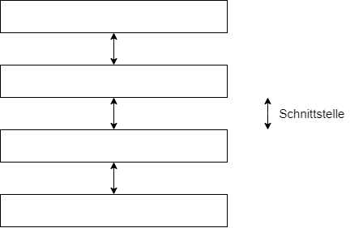

## Architekturmodelle Datenbanken

- 3-Ebenen Komponenten Modell

  => beschreibt eine Datenbank aus Sicht des Datenbankanwendungsentwicklers

- 5-Ebenen-Modell

  => Beschreibt eine Datenbank aus Sicht des Datenbankentwicklers

| Modell   |           Anwender            |
| -------- | :---------------------------: |
| 3-Ebenen | Datenbankanwendungsentwickler |
| 5-Ebenen |      Datenbankentwickler      |

## 3-(Ebenen)-Komponentenmodell

- Externe Ebene

  - Datenbankunabhängig
  - Anwendungsabhängig
  - Viele Schemata
  - Darstellung: 
    - UML-Klassendiagramm
    - ERM
    - Relationenmodell

- Konzeptuelle Ebene 

  - Stellt eine integrierte Gesamtübersicht aller Daten dar
  - => ein Schema
  - Modell / Darstellungsform
    - ERM
    - UML-Klassendiagramm

  - Datenbankunabhängig
  - Anwendungsunabhängig

- Interne Ebene
  - Anwendungsunabhängig
  - Datenbankabhängig
  - Ein Datenbankschema
    Darstellung:
    - Relationenmodell
    - Relationales Datenbankschema
    - CREATE TABLE-Anweisungen

### Warum ist die Bezeichnung *3-Ebenen(Schichten)-Modell* falsch?

**Schichtenmodell (ISO/OSI)**

Prinzip: 
Eine Schicht stellt standardisierte Dienste zur Verfügung, nutzt Dienste der darunterliegenden Schicht

Vorteil / Eigenschaft: 
Einzelne Schichten sind austauschbar

Richtiger: 
3-Komponenten Modell

